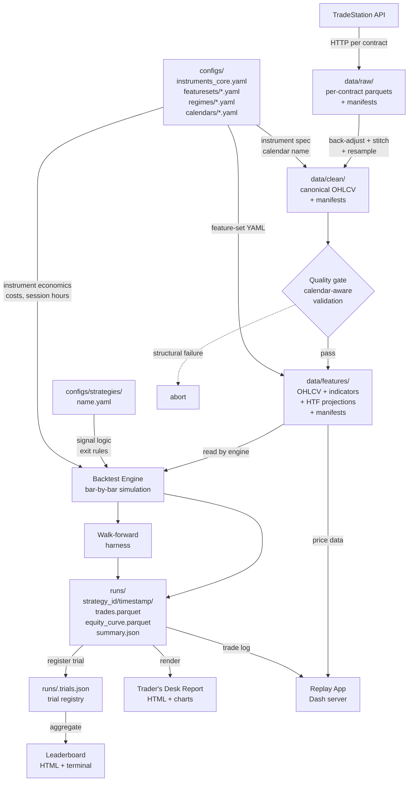

# Chapter 2 — System Architecture

> **Chapter status:** [EXISTS] — every component, data flow, and state
> location described here corresponds to code present at v1.0.

---

## 2.0 What this chapter covers

This chapter is the operator's map of the platform as a system. After
reading it you will understand what each module does (and does not do),
how data flows from TradeStation to a published report, why the data model
has three layers, what technology powers each layer, where every piece of
persistent state lives on disk, and what the CLI surface exposes. Later
chapters go deeper on each component; this chapter gives you the overview.

---

## 2.1 Component map

The platform is structured as an importable Python package,
`trading_research`, with fourteen sub-modules. Each sub-module owns a
distinct concern and does not reach into another sub-module's internals.

| Module | One-line purpose |
|--------|-----------------|
| `core` | Shared types and registries: `Instrument`, `InstrumentRegistry`, `StrategyConfig`, feature-set loader, strategy template registry. The vocabulary the rest of the platform speaks. |
| `data` | Data acquisition, validation, and the canonical bar schema. Includes the TradeStation client, the back-adjuster, the resampler, the calendar validator, and the manifest read/write helpers. |
| `indicators` | Indicator computation (ATR, RSI, Bollinger, MACD, SMA, Donchian, ADX, OFI, VWAP families) and the feature-set application layer that assembles them into a FEATURES parquet. |
| `strategies` | Signal logic: YAML expression evaluator, strategy templates (Python path), regime-filter registry, the Mulligan re-entry controller, and example strategy implementations. |
| `backtest` | The backtest engine and walk-forward harness. Bar-by-bar simulation, fill model, cost model, TP/SL resolution, EOD-flat, and trade-log production. |
| `risk` | Position sizing helpers: volatility targeting, fixed quantity, Kelly sizing. Capital allocation and portfolio-level constraint helpers. |
| `eval` | The full evaluation stack: summary metrics, bootstrap CIs, deflated Sharpe, walkforward aggregation, leaderboard, report generation (HTML), drawdown analysis, Monte Carlo, regime metrics, distribution analysis, stationarity suite, event studies, clustering, meta-labelling, SHAP. |
| `stats` | Statistical modules that are re-used across the platform but don't belong inside `eval`: stationarity tests (ADF, Hurst, OU half-life), multiple-testing correction (Bonferroni, Benjamini-Hochberg). |
| `pipeline` | The data pipeline drivers: `verify`, `inventory`, `rebuild`, `backfill`. These are the operations that act on `data/` and they are the modules the CLI calls. |
| `replay` | The visual trade forensics app (Dash). Loads FEATURES data and a trade log; renders a price chart with trigger-vs-fill markers, indicator overlays, and P&L by date. |
| `gui` | Placeholder for a future interactive launcher. No active code at v1.0; the module exists so the import path is stable when work begins. |
| `cli` | The command-line entry point. Thin wrappers over the modules above; produces structured output (tables, JSON). No business logic lives here. |
| `utils` | Logging initialisation (structlog), shared path helpers, date utilities. |

The dependency direction is one-way from top to bottom in the table: `cli`
calls `pipeline` and `eval`; `eval` calls `backtest` and `stats`; `backtest`
calls `strategies` and `data`; `data` calls `core`. Nothing in `core` or
`data` imports from `strategies` or `backtest`. Violations of this layering
are bugs, not style choices.

---

## 2.2 Data flow diagram

The full end-to-end path from raw vendor data to a published report:



Each arrow in this diagram corresponds to a CLI subcommand or a
programmatic call documented in the relevant chapter. The quality gate is
not optional; the pipeline aborts on structural failures rather than
producing degraded FEATURES data.

---

## 2.3 The three-layer data model

The architectural decision behind the data pipeline is recorded in
[`docs/architecture/data-layering.md`](../architecture/data-layering.md)
(ADR-001). The summary is:

```
data/raw/        →    data/clean/       →    data/features/
(immutable)           (canonical OHLCV)      (OHLCV + indicators)
ground truth          function of RAW        function of CLEAN
```

**RAW** is the immutable archive of what TradeStation returned, parsed into
parquet with a manifest recording the download's provenance. RAW files are
written once, never touched again. Re-downloading is the only acceptable way
to refresh them.

**CLEAN** is the canonical OHLCV form: back-adjusted (or unadjusted, both
are produced), resampled from 1m to 5m / 15m / 60m / 240m / 1D, and schema-
validated. CLEAN contains no indicators. This rule is load-bearing:
it means that indicator experiments never contaminate the historical record,
and indicator code changes require only rebuilding FEATURES, not re-downloading.

**FEATURES** is the consumer layer. It is CLEAN plus an indicator stack
defined by a versioned feature-set YAML (see Chapter 8) plus the daily
higher-timeframe bias columns projected from the 1D parquet (see Chapter 7.11).
Every strategy reads a FEATURES parquet; no strategy code touches RAW or CLEAN.

> *Why this:* without the three-layer separation, every indicator experiment
> would be either a destructive mutation of a shared file (unsafe, unreproducible),
> a full copy of the entire history (storage explosion), or an in-place schema
> addition (makes files non-comparable across time). The three layers make
> experiments cheap and revocable: FEATURES files are disposable; CLEAN files
> are stable; RAW files are the audit trail of vendor data.

For the full treatment — directory layout, filename conventions, manifest
schema, staleness rules, the look-ahead rule for HTF projections, and worked
examples — see **Chapter 4**.

---

## 2.4 Technology stack

| Layer | Technology | Chosen because |
|-------|-----------|----------------|
| Language | Python 3.12 | Dominant in quant research; type hints; mature data ecosystem |
| Package management | uv | Fast, deterministic, lock-file-based; `uv sync` is a single command from any clone |
| Data storage | Apache Parquet (pyarrow ≥ 15) | Columnar, compressed, metadata-capable; orders of magnitude faster than CSV for this access pattern |
| Dataframe operations | pandas ≥ 2.2 | Standard; tz-aware datetimes; resampling, groupby, merging |
| Calendar awareness | pandas-market-calendars ≥ 4.4 | CME, CBOT, and exchange holiday calendars in one dependency |
| Data validation | pydantic ≥ 2.6 | Schema enforcement at load time; `frozen=True` models for immutable configs |
| CLI | typer ≥ 0.12 | Type-annotated CLI with automatic `--help` generation; no maintenance of option parsers |
| Logging | structlog ≥ 24.1 | Machine-parseable JSON-line output; run IDs thread through log events |
| Visualisation | Dash ≥ 2.17 | Browser-served Dash app for the replay forensic cockpit; already a dependency, so re-usable for any future interactive launcher |
| Testing | pytest | Standard; property-based tests via Hypothesis for invariant checking |
| Linting | ruff | Fast; handles formatting and lint in one pass |

The platform runs on Windows 11 (development) and produces Linux-friendly
code: `pathlib.Path` everywhere, no `\\` path separators in source, tz-aware
datetimes. A deployment on a Linux node requires only `uv sync`.

Optional extras declared in `pyproject.toml`:

- `ml` — scikit-learn, XGBoost, UMAP, SHAP, Numba. Installed only when
  ML-augmented strategies or SHAP-based feature attribution are needed.
  Not required for rule-based strategy work.
- `dev` — pytest, ruff, hypothesis, ipykernel. Development-only; not
  needed in a production-equivalent environment.

---

## 2.5 Where state lives

The platform's state is distributed across several locations. Knowing which
location owns which category of state tells you where to look when something
is wrong and what is safe to delete.

| Location | What's here | Committed? | Deletable? |
|----------|-------------|------------|------------|
| `data/raw/` | Vendor parquets and manifest sidecars | No | Only by operator judgment; costly to re-download |
| `data/clean/` | Canonical OHLCV parquets and manifests | No | Rebuildable from RAW + code in minutes |
| `data/features/` | Indicator matrices and manifests | No | Rebuildable from CLEAN + feature-set config in minutes |
| `runs/` | Per-backtest outputs: trades, equity curve, summary | No | Archivable; old runs prunable with `clean runs` (see Chapter 56.5) |
| `runs/.trials.json` | The trial registry: every backtest, sweep variant, and walk-forward run | No | Validation-mode trials: never. Exploration-mode trials: purgeable after 180 days |
| `outputs/` | Leaderboards, work logs, exploration results | No | work-log/ never; others archivable |
| `configs/` | Instrument registry, feature-set YAMLs, strategy YAMLs, regime configs, calendar configs, broker margins | **Yes** | No — these are the platform's configuration and audit trail |
| `src/` | Python package | **Yes** | No |
| `docs/` | This manual, architecture records, pipeline reference | **Yes** | No |
| `.venv/` | Virtualenv created by `uv sync` | No | Rebuildable with `uv sync` |

The split between committed and not-committed is deliberate: everything that
is *derived* from other things (data, run outputs) is excluded from git.
Everything that is *configuration or code* (configs, src, docs) is committed.
The manifest system is what makes the derived data reproducible without
committing it.

The `runs/.trials.json` file is the one state file that grows unbounded
without automated pruning. It is the platform's memory of every experiment.
For disk-management guidance see Chapter 56.5; for the trial schema see
Chapter 32.

---

## 2.6 The CLI surface

Every operation the platform supports is reachable as a single
`uv run trading-research <subcommand>` invocation. There are no operations
that require interactive menus, multi-step wizards, or Python REPL sessions
for routine use. Detailed reference for each command is in Chapter 49;
this section is the navigator's overview.

The commands are grouped by the stage of the pipeline they serve:

### Data pipeline

| Command | Purpose |
|---------|---------|
| `pipeline --symbol S` | Full pipeline: rebuild CLEAN, validate, rebuild FEATURES |
| `rebuild clean --symbol S` | Rebuild CLEAN only (back-adjust, resample) |
| `rebuild features --symbol S --set T` | Rebuild FEATURES only for feature-set tag T |
| `verify` | Walk all manifests; report stale or missing files |
| `backfill-manifests` | Write manifests for pre-convention legacy files |
| `inventory` | Print table of all data files with sizes, row counts, manifest status |

### Strategy execution

| Command | Purpose |
|---------|---------|
| `backtest --strategy configs/strategies/name.yaml` | Single backtest with bootstrap CIs |
| `walkforward --strategy ... --n-folds N` | Walk-forward validation (rolling or purged) |
| `sweep --strategy ... --param k=v1,v2,v3` | Cartesian sweep over knob values |
| `stationarity --symbol S --timeframe T` | ADF + Hurst + OU half-life on a feature column |

### Reporting and exploration

| Command | Purpose |
|---------|---------|
| `report <run_id>` | Render the Trader's Desk HTML report for a run |
| `leaderboard` | Show and filter all recorded trials |
| `replay --symbol S` | Open the visual forensic cockpit in a browser |
| `portfolio` | Portfolio-level report across multiple strategies |

### Maintenance

| Command | Purpose |
|---------|---------|
| `validate-strategy` | Lint a strategy YAML before running it **[GAP — v1.0 target]** |
| `status` | Data freshness, last backtests, registered strategies **[GAP — v1.0 target]** |
| `clean` | Storage cleanup: runs, canonical files, features, trials **[GAP — v1.0 target]** |

All commands:

- Accept `--help` for the full option reference
- Produce tabular output by default; most support `--json` for machine-
  readable output
- Exit cleanly with code 0 (success) or non-zero (failure), allowing
  scripted pipelines
- Never prompt interactively — all inputs are CLI options

The two **[GAP]** commands (`validate-strategy` and `status`) are on the
v1.0 critical path. See Chapter 49.15–49.16 for their specifications.

---

## 2.7 Related references

### Design records

- [`docs/architecture/data-layering.md`](../architecture/data-layering.md)
  — ADR-001: why the pipeline has three layers, what alternatives were
  rejected, and what invariants the design must maintain.

### Manual chapters

- **Chapter 4** — Data Pipeline & Storage: the three-layer model in full
  detail, including directory layout, filename conventions, manifest schema,
  cold-start procedure, and worked examples.
- **Chapter 5** — Instrument Registry: the `Instrument` contract, the five
  registered instruments, the TradeStation symbol mapping.
- **Chapter 14** — The Backtest Engine: bar-by-bar simulation design,
  fill models, cost model.
- **Chapter 49** — CLI Command Reference: full reference for every command
  listed in §2.6.
- **Chapter 51** — File Layout Reference: the repository tree, what's
  committed, run output structure.

---

*End of Chapter 2. Next: Chapter 3 — Operating Principles.*
