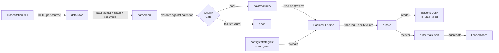
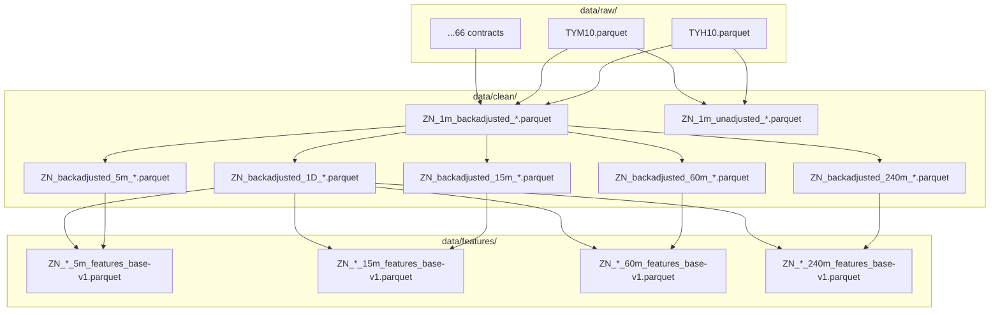
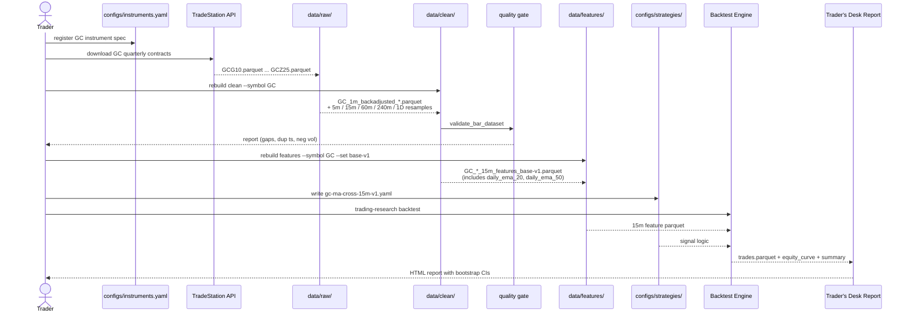

# Chapter 4 — Data Pipeline & Storage

> **Chapter status:** [EXISTS] — every section in this chapter documents a
> capability already present in the platform at commit `2b49890`. No code work
> is needed to make this chapter accurate; the work is to verify each cited
> path remains stable.

---

## 4.0 What this chapter covers

This chapter is the operator's reference for the data pipeline — the path
that historical 1-minute bars travel from TradeStation's API through to
the indicator-rich parquet files that strategies consume. After reading
this chapter you will:

- Know what each of the three data layers (RAW, CLEAN, FEATURES) is for
  and what the rules around it are
- Be able to locate any data file on disk and decode its filename
- Be able to read a manifest sidecar and decide whether the file is fresh
- Know when to rebuild what and which CLI command does it
- Understand the CME trade-date convention and why a "daily bar" is a
  session, not a calendar day
- Understand the look-ahead rule for higher-timeframe projections and why
  it is the most important unit test in the feature builder
- Be able to do a cold-start recovery after extended absence
- Be able to add a new timeframe to the pipeline without contaminating
  any canonical data

This chapter is roughly 10 pages. It is also referenced by Chapters 5
(Instruments), 6 (Bar Schema), 7 (Indicators), 8 (Feature Sets), and 54
(Cold-Start Procedure).

---

## 4.1 The three layers in detail

The pipeline is structured as three layers, in order of decreasing
durability:

```
data/raw/        →    data/clean/       →    data/features/
(immutable)           (canonical OHLCV)      (indicators + HTF bias)
ground truth          function of RAW        function of CLEAN
```

| Layer | Contains | Mutable? | Rebuildable from |
|-------|----------|----------|------------------|
| RAW | Per-contract downloads, exactly as TradeStation returned them | No, ever | Re-download only |
| CLEAN | Canonical OHLCV per (symbol, timeframe, adjustment) | Rebuildable | RAW + code |
| FEATURES | Flat per-bar matrices: price + indicators + HTF projections | Rebuildable | CLEAN + feature-set config |

The architectural decision behind this separation is recorded in
[`docs/architecture/data-layering.md`](../architecture/data-layering.md)
(ADR-001). The summary: keeping CLEAN free of indicators means that the
inevitable indicator experimentation does not contaminate the historical
record, and bug fixes in indicator code only require rebuilding FEATURES
rather than re-downloading or re-resampling.

### 4.1.1 The load-bearing rule

> **CLEAN never contains indicators.**

If a column is computable from price alone — moving averages, RSI, MACD,
Bollinger Bands, VWAP, ATR, OFI — it does not live in CLEAN. It lives in
FEATURES. Strategy code consumes FEATURES; indicator validation code
consumes CLEAN. There is no exception to this rule. If you find yourself
about to add an indicator column to a CLEAN parquet, stop and re-read this
section.

> *Why this:* If indicators lived in CLEAN, every new indicator experiment
> would be either a destructive mutation of a shared file (unsafe and
> unreproducible), a new copy of the entire 16-year history (the "30
> versions of CLEAN" problem), or an in-place schema addition (which
> makes CLEAN files non-comparable across time). Forcing indicators into a
> separate, disposable layer makes CLEAN small, canonical, and stable;
> experiments proliferate cheaply in FEATURES.

### 4.1.2 Layer responsibilities

**RAW** is the ground truth. It is the bytes TradeStation returned, parsed
into a parquet, with a manifest recording the download's provenance. RAW
files are written once and never touched again. Re-downloading is the only
acceptable way to refresh them.

**CLEAN** is the canonical OHLCV form: the timestamps, prices, and volumes
that every downstream system can trust. CLEAN is the result of three
distinct operations on RAW: back-adjustment of expiring contracts (or
not — both adjusted and unadjusted variants are produced), resampling
from 1m to higher timeframes (5m, 15m, 60m, 240m, 1D), and per-bar
schema enforcement. CLEAN files conform to the `BAR_SCHEMA` defined
in [`src/trading_research/data/schema.py`](../../src/trading_research/data/schema.py)
(see Appendix A).

**FEATURES** is the consumer-facing layer. It contains everything in
CLEAN plus an indicator stack defined by a *feature set* (see Chapter 8)
plus a higher-timeframe (HTF) bias stack projected from the daily bar.
A FEATURES parquet is a flat matrix: one row per bar, every column
addressable by a strategy YAML expression.

### 4.1.3 End-to-end flow diagram

The full path data takes from TradeStation's API through to a Trader's
Desk report:



Each arrow corresponds to a CLI subcommand or a programmatic call that is
documented elsewhere in this manual; the boxes correspond to directories
or output artefacts. Red-line transitions are quality gates that abort
the pipeline rather than producing degraded outputs.

### 4.1.4 Per-instrument layer dependency graph

For a single instrument (here, ZN) the per-file dependency graph looks
like:



The 1D parquet feeds every FEATURES file because every feature parquet
needs the daily HTF bias columns (daily EMA 20/50/200, daily ATR,
daily MACD histogram). This is the look-ahead-protected join described
in §4.6.

---

## 4.2 Directory layout

The committed-into-repo layout under `data/` is:

```
data/
├── raw/
│   ├── contracts/
│   │   ├── TYH10.parquet
│   │   ├── TYH10.parquet.manifest.json
│   │   ├── TYM10.parquet
│   │   ├── TYM10.parquet.manifest.json
│   │   ├── ... (66 quarterly TY contracts for ZN)
│   │   ├── ADH24.parquet                    # 6A contracts
│   │   ├── ADH24.parquet.manifest.json
│   │   ├── CDH24.parquet                    # 6C contracts
│   │   ├── ECH24.parquet                    # 6E contracts
│   │   ├── NE1H24.parquet                   # 6N contracts
│   │   └── ...
│   ├── ZN_1m_2010-01-01_2026-04-11.parquet         # original full pull
│   └── ZN_1m_2010-01-01_2026-04-11.parquet.manifest.json
│
├── clean/
│   ├── ZN_1m_backadjusted_2010-01-01_2026-04-11.parquet
│   ├── ZN_1m_unadjusted_2010-01-01_2026-04-11.parquet
│   ├── ZN_backadjusted_5m_2010-01-03_2026-04-10.parquet
│   ├── ZN_backadjusted_15m_2010-01-03_2026-04-10.parquet
│   ├── ZN_backadjusted_60m_2010-01-03_2026-04-10.parquet
│   ├── ZN_backadjusted_240m_2010-01-03_2026-04-10.parquet
│   ├── ZN_backadjusted_1D_2010-01-03_2026-04-10.parquet
│   ├── ZN_roll_log_2010-01-01_2026-04-11.json
│   ├── 6A_backadjusted_5m_2010-01-03_2026-05-01.parquet
│   ├── 6C_backadjusted_5m_2010-01-03_2026-05-01.parquet
│   └── ...
│
└── features/
    ├── ZN_backadjusted_5m_features_base-v1_2010-01-03_2026-04-10.parquet
    ├── ZN_backadjusted_5m_features_base-v1_2010-01-03_2026-04-10.parquet.manifest.json
    ├── ZN_backadjusted_15m_features_base-v1_2010-01-03_2026-04-10.parquet
    ├── ZN_backadjusted_60m_features_base-v1_2010-01-03_2026-04-10.parquet
    ├── ZN_backadjusted_240m_features_base-v1_2010-01-03_2026-04-10.parquet
    ├── 6A_backadjusted_5m_features_base-v1_2010-01-03_2026-05-01.parquet
    ├── 6A_backadjusted_15m_features_base-v1_2010-01-03_2026-05-01.parquet
    ├── 6A_backadjusted_60m_features_base-v1_2010-01-03_2026-05-01.parquet
    ├── 6A_backadjusted_240m_features_base-v1_2010-01-03_2026-05-01.parquet
    └── ...
```

`data/` is **not** committed to the repository. The directory is
rebuildable from RAW plus the code in `src/trading_research/`, and RAW
itself is downloaded from TradeStation. Treat `data/` as a build artefact
that lives only on the operator's machine.

> *Why not commit `data/`:* The full data set is several gigabytes per
> instrument-year, the project supports five instruments today, and the
> manifest system makes the contents reproducible from a smaller set of
> inputs (RAW contracts plus configuration). Committing `data/` would
> bloat the repository with files that the manifest system already
> describes precisely.

---

## 4.3 Filename conventions

Every file in `data/` follows a strict naming convention. The conventions
are not aesthetic — they are how the platform identifies files
programmatically. A file with a malformed name is invisible to the
pipeline.

### 4.3.1 RAW

Per-contract downloads:

    {ts_root}{month_code}{year_code}.parquet

where `ts_root` is the TradeStation root symbol (TY, AD, CD, EC, NE1 — see
Chapter 5 for the CME-to-TradeStation mapping), `month_code` is the
quarterly contract code (H=March, M=June, U=September, Z=December), and
`year_code` is the two-digit year. Examples: `TYH10.parquet`,
`ADM24.parquet`, `NE1Z25.parquet`.

Bulk pulls (legacy, used for the initial ZN historical):

    {symbol}_{tf}_{start}_{end}.parquet

where `symbol` is the CME root and dates are `YYYY-MM-DD`. Example:
`ZN_1m_2010-01-01_2026-04-11.parquet`.

### 4.3.2 CLEAN

    {symbol}_{adjustment}_{tf}_{start}_{end}.parquet

- `symbol` ∈ {`ZN`, `6E`, `6A`, `6C`, `6N`} — CME root symbol (see Chapter 5)
- `adjustment` ∈ {`backadjusted`, `unadjusted`}
- `tf` ∈ {`1m`, `5m`, `15m`, `60m`, `240m`, `1D`}

Example: `ZN_backadjusted_60m_2010-01-03_2026-04-10.parquet`.

There is one exception to the timeframe placement: the original ZN pull
predates the convention and uses `ZN_1m_backadjusted_*`. Both orderings
work in code; new files should follow the documented convention.

### 4.3.3 FEATURES

    {symbol}_{adjustment}_{tf}_features_{feature_set_tag}_{start}_{end}.parquet

- `feature_set_tag` is the filename of the YAML in `configs/featuresets/`
  without extension (`base-v1`, `base-v2`, `experiment-13min`, etc.)

Example:
`6A_backadjusted_60m_features_base-v1_2010-01-03_2026-05-01.parquet`.

Multiple feature-set tags coexist in the same directory. The tag is the
contract between the config, the filename, and the manifest.

---

## 4.4 Manifest schema and staleness rules

Every file in RAW, CLEAN, and FEATURES has a sibling
`<filename>.parquet.manifest.json`. The manifest is how the pipeline
answers the question "where did this file come from and is it still
fresh?" without depending on human memory.

### 4.4.1 Common manifest fields

```json
{
  "schema_version": 1,
  "layer": "clean",
  "symbol": "ZN",
  "timeframe": "5m",
  "row_count": 1064432,
  "date_range": {
    "start": "2010-01-03T23:00:00+00:00",
    "end":   "2026-04-10T21:55:00+00:00"
  },
  "built_at": "2026-04-13T18:00:00+00:00",
  "code_commit": "a1b2c3d4",
  "sources": [
    {
      "path": "data/clean/ZN_1m_backadjusted_2010-01-01_2026-04-11.parquet",
      "row_count": 4673993,
      "built_at": "2026-04-13T17:30:00+00:00"
    }
  ],
  "parameters": { "freq": "5min" }
}
```

Every manifest carries:

- `schema_version` — integer; bumped only when the manifest schema itself
  changes
- `layer` — one of `raw`, `clean`, `features`
- `symbol`, `timeframe` — identification
- `row_count`, `date_range` — quick sanity check; can be compared to the
  parquet without reading the data
- `built_at` — UTC timestamp; the file's age
- `code_commit` — the git commit hash at build time; allows the pipeline
  to detect that the building code has changed
- `sources` — list of input files this output was built from, with their
  own `built_at` for staleness comparison
- `parameters` — the configuration that drove the build (resample
  frequency, indicator parameters, feature-set tag, etc.)

### 4.4.2 Layer-specific fields

**RAW manifest** adds:

```json
{
  "source": "tradestation",
  "ts_symbol": "TYM26",
  "download_session_id": "...",
  "vendor_response_metadata": { ... }
}
```

**CLEAN manifest** adds the list of RAW sources plus the transformation
parameters (back-adjustment method, resample frequency, etc.).

**FEATURES manifest** adds:

```json
{
  "feature_set_tag": "base-v1",
  "feature_set_config": "configs/featuresets/base-v1.yaml",
  "indicators": [
    {"name": "atr", "period": 14},
    {"name": "rsi", "period": 14},
    {"name": "macd", "fast": 12, "slow": 26, "signal": 9},
    "..."
  ],
  "htf_projections": [
    {"source_tf": "1D", "columns": ["daily_ema_20", "daily_ema_50"]}
  ]
}
```

### 4.4.3 Staleness rules

A file is **stale** if any of:

1. Any source file listed in `sources` has a newer `built_at` than this
   file's `built_at`. (The dependency graph is upside-down compared to
   intuition: a file is older than its sources only if it has not been
   rebuilt since the source was rebuilt.)
2. `code_commit` is older than the current HEAD *and* the relevant module
   in `src/` has been modified since. This requires the verifier to know
   the dependency map between code modules and data layers; today the
   `verify` command applies a coarse heuristic and flags any code commit
   older than HEAD.
3. `parameters` do not match the config that generated them. For FEATURES
   parquets specifically: if `configs/featuresets/<tag>.yaml` has been
   modified since the file was built and the tag has not been bumped, the
   manifest's recorded indicators will not match the YAML, and the
   verifier flags this immediately.

The CLI command for staleness checking is `uv run trading-research verify`
— see Chapter 49.1.

> *Why manifests rather than embedded metadata:* parquet supports embedded
> metadata, but the manifest is a separate, human-readable file
> deliberately. An operator should be able to inspect provenance with
> `cat`; recovering provenance from binary parquet metadata requires
> tooling and is harder to script around.

---

## 4.5 The CME trade-date convention

A "daily bar" for CME futures is not a calendar day. The Globex session
runs from 18:00 ET on the prior calendar day to 17:00 ET on the trade
date, with a one-hour maintenance halt. This is the convention used by
TradeStation, TradingView, Bloomberg, and CME's own settlement files.

### 4.5.1 The implementation

The conversion from intraday timestamps to the trade date is three lines
of pandas:

```python
df["trade_date"] = (df["timestamp_ny"] + pd.Timedelta(hours=6)).dt.date
daily = df.groupby("trade_date").agg({
    "open": "first", "high": "max", "low": "min", "close": "last",
    "volume": "sum", "buy_volume": "sum", "sell_volume": "sum",
})
daily["timestamp_utc"] = df.groupby("trade_date")["timestamp_utc"].first()
```

The +6-hour shift turns the 18:00 ET session open into 24:00 ET = midnight
of the trade date. Every intraday bar in that session now shares a
`trade_date`. Daylight Saving Time is handled by pandas because
`timestamp_ny` is timezone-aware.

> *Why this works without session-gap detection:* the +6-hour shift
> creates a deterministic mapping from any intraday timestamp to the
> correct trade date for that instrument's session. There are no edge
> cases requiring session-id assignment, no special handling of DST
> transitions, no logic for distinguishing "session A" from "session B"
> on a holiday. The simplest implementation that produces correct
> results is preferred.

### 4.5.2 Per-instrument session windows

Different instruments have different RTH windows (regular trading hours,
the daytime liquid window inside the 23-hour Globex session):

| Instrument | RTH open (ET) | RTH close (ET) |
|------------|---------------|----------------|
| ZN | 08:20 | 15:00 |
| 6E, 6A, 6C, 6N | 08:00 | 17:00 |

These come from `configs/instruments.yaml`. RTH windows are consumed by
the calendar validator and the EOD-flat logic in the backtest engine —
hard-coding RTH hours into strategy code is forbidden (see Chapter 5).

---

## 4.6 The look-ahead rule for HTF projections

This section codifies the most important invariant in the feature
builder. Read it carefully.

> **At any intraday bar with trade-date T, the daily indicator value seen
> is the one computed from daily bars with trade-date strictly less than
> T.**

In code:

```python
daily["daily_ema_20_shifted"] = daily["daily_ema_20"].shift(1)
intraday = intraday.merge(
    daily[["daily_ema_20_shifted"]],
    left_on="trade_date", right_index=True, how="left"
)
```

The `shift(1)` is the load-bearing line. Without it, every intraday bar
in session N sees the daily EMA computed from session N's own close —
which means the strategy can use bar T's information at bar T, which is
look-ahead.

This is not a theoretical concern. Vectorised feature pipelines that
compute everything in pandas and then join naively *will* leak data unless
the shift is explicit. The feature builder includes a unit test that:

1. Generates synthetic 1m bars for two trading sessions
2. Computes a daily EMA(2) on the daily bars
3. Verifies that intraday bars in session 2 see the EMA computed *through
   session 1*, not through session 2

If this test fails, the feature build is rejected before any parquet is
written. The test is in
[`tests/test_features_lookahead.py`](../../tests/test_features_lookahead.py)
(verify path before citing in published manual).

> *Why this is non-negotiable:* a backtest that uses leaked HTF data
> produces results that look modestly better than reality, by an amount
> roughly equal to the autocorrelation of the daily indicator. For ZN's
> daily EMA(20) at 5m bars, that's enough to make a Sharpe of 0.7 look
> like 1.1 — a fatal misjudgement of the strategy's true performance.
> The shift is the difference between honest and dishonest backtests.

---

## 4.7 The CLI commands that drive the pipeline

The pipeline is operated through `uv run trading-research <subcommand>`.
The pipeline-relevant subcommands are:

### 4.7.1 `pipeline` — the full path

```
uv run trading-research pipeline --symbol ZN --set base-v1
```

Runs all three stages end to end: rebuild CLEAN, validate, rebuild
FEATURES. This is the canonical entry point when you want a fresh
historical dataset for an instrument. Common options:

| Option | Default | Purpose |
|--------|---------|---------|
| `--symbol` | required | CME root symbol |
| `--set` | `base-v1` | feature-set tag for the FEATURES build |
| `--start`, `--end` | full history | date range filter for CLEAN rebuild |
| `--skip-validate` | False | skip stage 2 (use only when debugging) |

If the validation stage finds structural failures (duplicate timestamps,
negative volumes, inverted high/low) the pipeline aborts before stage 3.
Calendar gaps are reported but do not abort, because back-adjusted
continuous contracts produce expected gaps at roll seams.

See Chapter 49.5 for the full reference.

### 4.7.2 `rebuild clean` — CLEAN only

```
uv run trading-research rebuild clean --symbol ZN
```

Rebuilds every CLEAN parquet for the named symbol from cached RAW
contracts in `data/raw/contracts/`. Does not call the TradeStation API.
The expected use is after a code change in
`src/trading_research/data/continuous.py` or
`src/trading_research/data/resample.py` — a back-adjustment fix or a
resample-rule change.

If RAW contracts are missing, the command fails before producing any
output. Use the data downloader (separately documented) to acquire them
first.

### 4.7.3 `rebuild features` — FEATURES only

```
uv run trading-research rebuild features --symbol ZN --set base-v1
```

Rebuilds every FEATURES parquet for the named symbol/tag from CLEAN.
Used after a code change in `src/trading_research/indicators/` or after
a YAML edit in `configs/featuresets/<tag>.yaml`. Note: editing a YAML
without bumping the tag will produce inconsistent FEATURES files; if you
edit a YAML, bump the tag and rebuild.

### 4.7.4 `verify` — staleness audit

```
uv run trading-research verify
```

Walks every manifest under `data/` and reports stale or missing files.
Exit code 0 = everything fresh; exit code 1 = at least one staleness.
Run this whenever you suspect the data has drifted or after an absence.
See Chapter 49.1.

### 4.7.5 `inventory` — what's on disk

```
uv run trading-research inventory
```

Prints a table of every data file with size, row count, and manifest
status. Useful as a "what do I have?" snapshot. See Chapter 49.6.

---

## 4.8 Cold-start checklist

You haven't touched the project in three months. Here is the path back to
working order.

### 4.8.1 Environment

1. **`uv sync`** — reinstalls dependencies from `uv.lock`.
2. **`uv run pytest`** — confirms the code still runs. If anything fails,
   fix before touching data.

### 4.8.2 Data

3. **`uv run trading-research verify`** — walks every manifest and reports
   stale or orphaned files. If this returns exit code 0, the data layer is
   clean and you can proceed. If it returns 1, read the report and fix
   each item before continuing.
4. **`uv run trading-research inventory`** — quick visual confirmation of
   what's on disk. Compare to the directory layout in §4.2.

### 4.8.3 Decide what to rebuild

5. **If CLEAN code changed since the last build:**
   `uv run trading-research rebuild clean --symbol <S>` for each affected
   symbol. The verifier in step 3 should already have flagged this; if
   not, you can compare `git log` since the manifest's `code_commit`
   against the file lists in `src/trading_research/data/`.
6. **If an indicator changed or a feature-set tag was edited:**
   `uv run trading-research rebuild features --symbol <S> --set <tag>`
   for each affected combination.
7. **If nothing changed:** you're done with data. Proceed to strategy
   work (Chapter 16).

If step 3 shows unexpected files or step 7 produces a different result
than the manifest recorded — stop and investigate. The manifest is
authoritative; a mismatch means the pipeline was bypassed and something
manual happened. Don't paper over it.

The full cold-start procedure including strategy testing and report
generation is in Chapter 54.

---

## 4.9 Worked example — adding a 13-minute timeframe experiment

This example demonstrates the pipeline's experimentation discipline:
non-standard work happens cheaply, in isolation, and rolls back to three
file deletions.

**Goal:** test a non-standard 13-minute bar for ZN with the base-v1
indicator set, without touching any canonical file, without re-downloading
anything, and without leaving permanent clutter.

### 4.9.1 Step 1 — extend CLEAN with a 13m parquet

The resampler in `src/trading_research/data/resample.py` handles arbitrary
sub-hour frequencies. Programmatic invocation:

```python
from pathlib import Path
from trading_research.data.resample import resample_and_write

resample_and_write(
    source=Path("data/clean/ZN_1m_backadjusted_2010-01-01_2026-04-11.parquet"),
    output_dir=Path("data/clean/"),
    freqs=["13min"],
    symbol="ZN",
)
```

This produces `data/clean/ZN_backadjusted_13m_2010-01-03_2026-04-10.parquet`
and its manifest. Cost: ~30 seconds of resample time. No re-download,
no impact on the 5m or 15m parquets.

### 4.9.2 Step 2 — create a feature-set tag for the experiment

```
cp configs/featuresets/base-v1.yaml configs/featuresets/experiment-13min.yaml
```

Edit the new file's `tag:` to `experiment-13min` and add a `comment:`
field noting the experiment purpose. The indicator list and HTF
projections do not change — that's the point of the experiment, holding
the feature set constant while varying the timeframe.

### 4.9.3 Step 3 — build the feature parquet

```python
from pathlib import Path
from trading_research.indicators.features import build_features

build_features(
    price_path=Path("data/clean/ZN_backadjusted_13m_2010-01-03_2026-04-10.parquet"),
    price_1m_path=Path("data/clean/ZN_1m_backadjusted_2010-01-01_2026-04-11.parquet"),
    daily_path=Path("data/clean/ZN_backadjusted_1D_2010-01-03_2026-04-10.parquet"),
    output_dir=Path("data/features/"),
    symbol="ZN",
    feature_set_tag="experiment-13min",
)
```

This produces
`data/features/ZN_backadjusted_13m_features_experiment-13min_2010-01-03_2026-04-10.parquet`
and its manifest. Cost: roughly the same as building the 15m feature
parquet.

### 4.9.4 Step 4 — run a strategy against it

In your strategy YAML:

```yaml
strategy_id: zn-experiment-13m-fade-v1
symbol: ZN
timeframe: 13m
feature_set: experiment-13min
# ... rest of strategy YAML
```

Nothing else changes. The base-v1 feature files for 5m, 15m, 60m, 240m
are untouched.

### 4.9.5 Step 5 — delete the experiment when done

```
rm data/clean/ZN_backadjusted_13m_2010-01-03_2026-04-10.parquet
rm data/clean/ZN_backadjusted_13m_2010-01-03_2026-04-10.parquet.manifest.json
rm data/features/ZN_backadjusted_13m_features_experiment-13min_2010-01-03_2026-04-10.parquet
rm data/features/ZN_backadjusted_13m_features_experiment-13min_2010-01-03_2026-04-10.parquet.manifest.json
rm configs/featuresets/experiment-13min.yaml
```

Optionally keep the 13m CLEAN parquet if the timeframe stays interesting.
Git history remembers the YAML if you want to revive it.

**What this example demonstrates:**

- Experiments cost one CLEAN addition + one config + one feature build.
  No copy of 16 years of CLEAN.
- The base-v1 baseline is never touched. There is no risk of contaminating
  canonical data.
- Rollback is five file deletions and one YAML deletion. There is no
  version-tracking archaeology.
- Manifests tell future-you (or a future agent session) exactly what each
  file is and where it came from.

---

## 4.10 What not to do

These are operations the pipeline forbids, in priority order. Each is
listed with the reason.

| Forbidden operation | Why |
|---------------------|-----|
| Adding indicator columns to CLEAN parquets | Destroys the layer separation; produces "30 versions of CLEAN"; experiments contaminate canonical data |
| Renaming a feature-set tag | Breaks every manifest that referenced the old tag; correct procedure is delete-and-recreate |
| Editing RAW files | RAW is the audit trail of vendor data; any vendor error must be documented in `configs/known_outages.yaml` (planned, see Chapter 6.5), not by mutating the parquet |
| Bypassing `rebuild` to hand-edit a CLEAN or FEATURES file | Breaks reproducibility; manifest will lie about provenance |
| Committing `data/` to the repository | Defeats the manifest-based rebuild model; git would track gigabytes of derived data |
| Editing a feature-set YAML without bumping the tag | Produces FEATURES files inconsistent with their manifest's recorded indicator list |
| Computing indicators in strategy code | Indicators belong in feature sets, not strategies; strategies are *signal* code, indicators are *data* code |

If the pipeline cannot express what you need, the answer is to extend the
pipeline, not to bypass it.

---

## 4.11 Worked example — adding gold (GC) from cold

This example takes a hypothesis the operator has not yet been able to
test and walks the entire pipeline end to end: a trader wants to test
mean reversion of gold around its 20-day and 50-day moving averages on
a 15-minute chart. The platform does not currently have gold (GC) data,
and gold is not even registered in the instrument config. Every step
required to go from "I want to test this" to "I have a backtest report"
is shown.

> **Aside on instrument choice:** standard CME gold (GC, root code GC,
> 100 oz) requires substantial margin — recent CME margin increases put
> standard contracts out of reach for a typical retail account. The
> realistic vehicle for the operator's account is **micro gold (MGC, 10
> oz)** at a tenth of the notional. The example below uses GC because
> the workflow is identical for either contract; substitute MGC where
> appropriate. The contract spec section calls out which numbers
> change.

### 4.11.1 Cold-start state

```
$ uv run trading-research inventory
... (current inventory output, no gold rows)
```

We confirm: no GC files in `data/raw/`, no GC in `configs/instruments.yaml`,
no GC strategy YAMLs. We are starting from zero.



### 4.11.2 Step 1 — register GC in the instrument spec

Edit `configs/instruments.yaml`. The new entry is appended at the end of
the `instruments:` map; the rest of the file is untouched. Reference
sources for the values: CME contract specifications page, TradeStation
symbol verification (use the data downloader CLI, see Chapter 5.4).

```yaml
GC:
  root_symbol: GC
  continuous_symbol: "@GC"        # TradeStation continuous contract.
                                  # Verify with TS API before relying on this.
  description: "Gold futures (100 troy oz)"
  exchange: COMEX
  asset_class: metals
  currency: USD

  # 1 tick = 0.10 USD/oz = $10 per 100-oz contract.
  tick_size: 0.10
  tick_value_usd: 10.0
  point_value_usd: 100.0
  contract_size_face_value: 100   # 100 troy oz

  session:
    timezone: America/New_York
    globex:
      open:  "18:00"
      close: "17:00"               # next-day close
    rth:
      open:  "08:20"                # COMEX gold pit open historically
      close: "13:30"                # COMEX gold pit close

  roll:
    convention: first_business_day_of_expiration_month
    notes: "Active months are GJM/GZ (Feb/Apr/Jun/Aug/Oct/Dec). Gold rolls earlier than typical quarterlies; verify volume migration before each roll."

  data:
    base_timeframe: 1m
    historical_source: tradestation
    tradestation_session_template: null
    calendar: CMEGlobex_Metals     # pandas-market-calendars metals calendar

  backtest_defaults:
    slippage_ticks: 1               # per side; $10 for GC
    commission_usd: 2.50            # per side; verify TS rate for COMEX
```

> **For MGC (micro gold) instead:** the spec is structurally identical
> with `tick_size: 0.10`, `tick_value_usd: 1.0`, `point_value_usd: 10.0`,
> `contract_size_face_value: 10`, and a different `continuous_symbol`.
> The session and calendar are identical.

After editing, verify the new instrument loads:

```
uv run python -c "from trading_research.core.instruments import InstrumentRegistry; print(InstrumentRegistry().get('GC'))"
```

### 4.11.3 Step 2 — download RAW contracts

GC follows COMEX's bi-monthly active-month convention; the relevant
month codes are G (Feb), J (Apr), M (Jun), Q (Aug), V (Oct), Z (Dec).
For 16 years of history (2010 onward) that is approximately 96
quarterly contract files.

```
uv run python -m trading_research.data.tradestation \
    --symbol GC \
    --start 2010-01-01 \
    --end   2026-05-04
```

This streams contract-by-contract from TradeStation into
`data/raw/contracts/GCG10.parquet`, `GCJ10.parquet`, `GCM10.parquet`,
... through `GCZ25.parquet`, with manifest sidecars. Expected duration
is 30–90 minutes depending on TradeStation rate limits; the downloader
is resumable.

> *What can fail here:* TradeStation's session-template rules apply
> only to equities and are nulled for futures, so the API may decline
> requests outside RTH hours. Calendar-aware request scheduling is
> in `src/trading_research/data/tradestation/client.py`.

### 4.11.4 Step 3 — rebuild CLEAN

```
uv run trading-research rebuild clean --symbol GC
```

Output (in approximate order):

```
data/clean/GC_1m_backadjusted_2010-01-04_2026-05-04.parquet
data/clean/GC_1m_backadjusted_2010-01-04_2026-05-04.parquet.manifest.json
data/clean/GC_1m_unadjusted_2010-01-04_2026-05-04.parquet
data/clean/GC_1m_unadjusted_2010-01-04_2026-05-04.parquet.manifest.json
data/clean/GC_backadjusted_5m_2010-01-04_2026-05-04.parquet
data/clean/GC_backadjusted_15m_2010-01-04_2026-05-04.parquet
data/clean/GC_backadjusted_60m_2010-01-04_2026-05-04.parquet
data/clean/GC_backadjusted_240m_2010-01-04_2026-05-04.parquet
data/clean/GC_backadjusted_1D_2010-01-04_2026-05-04.parquet
data/clean/GC_roll_log_2010-01-04_2026-05-04.json
```

Each file gets a manifest sidecar; the roll log records every contract
change-over for audit. Expected duration: 5–15 minutes for 16 years of
COMEX gold.

### 4.11.5 Step 4 — validate

The pipeline's `validate` stage is invoked automatically in
`trading-research pipeline`; here we ran the lower-level `rebuild
clean` so we should validate explicitly:

```
uv run trading-research verify
```

For new instruments specifically, look for:

- Duplicate timestamps: must be 0
- Negative volumes: must be 0
- Inverted high/low: must be 0
- Calendar gaps: are expected at the COMEX maintenance halt and at
  contract roll seams; informational, not fatal
- Buy/sell volume coverage: TradeStation order-flow attribution may be
  partial for older contracts; warning only

If any structural failure appears, the pipeline aborts before features
are built. Investigate before proceeding.

### 4.11.6 Step 5 — rebuild FEATURES

```
uv run trading-research rebuild features --symbol GC --set base-v1
```

Because `base-v1` already includes `daily_ema_20`, `daily_ema_50` (and
`daily_ema_200`, `daily_atr_14`, `daily_adx_14`, `daily_macd_hist`), no
feature-set edit is required. The trader's hypothesis (15-minute bars
with daily MA(20) and MA(50) bias) is satisfied by base-v1 directly.

Output:

```
data/features/GC_backadjusted_5m_features_base-v1_2010-01-04_2026-05-04.parquet
data/features/GC_backadjusted_15m_features_base-v1_2010-01-04_2026-05-04.parquet
data/features/GC_backadjusted_60m_features_base-v1_2010-01-04_2026-05-04.parquet
data/features/GC_backadjusted_240m_features_base-v1_2010-01-04_2026-05-04.parquet
```

Expected duration: 5–10 minutes.

### 4.11.7 Step 6 — write the strategy YAML

`configs/strategies/gc-ma-cross-15m-v1.yaml`:

```yaml
strategy_id: gc-ma-cross-15m-v1
symbol: GC
timeframe: 15m
description: >
  Gold 15-minute mean reversion around the daily 20/50 EMA stack.
  Long when price closes below daily_ema_20 with daily_ema_20 above
  daily_ema_50 (bullish trend, intraday pullback). Short on the
  symmetric setup.

knobs:
  pullback_atr_mult: 1.0
  stop_atr_mult: 1.5
  target_atr_mult: 2.5

entry:
  long:
    all:
      - "close < daily_ema_20 - pullback_atr_mult * atr_14"
      - "daily_ema_20 > daily_ema_50"
  short:
    all:
      - "close > daily_ema_20 + pullback_atr_mult * atr_14"
      - "daily_ema_20 < daily_ema_50"

exits:
  stop:
    long:  "close - stop_atr_mult * atr_14"
    short: "close + stop_atr_mult * atr_14"
  target:
    long:  "close + target_atr_mult * atr_14"
    short: "close - target_atr_mult * atr_14"

backtest:
  fill_model: next_bar_open
  same_bar_justification: ""
  eod_flat: true
  max_holding_bars: 26      # ~6.5 RTH hours at 15m
  use_ofi_resolution: false
  quantity: 1
```

### 4.11.8 Step 7 — run the backtest, walk-forward, and report

```
# Single backtest with bootstrap CIs:
uv run trading-research backtest --strategy configs/strategies/gc-ma-cross-15m-v1.yaml

# Walk-forward (5 folds):
uv run trading-research walkforward --strategy configs/strategies/gc-ma-cross-15m-v1.yaml --n-folds 5

# Render the Trader's Desk report:
uv run trading-research report gc-ma-cross-15m-v1
```

The report is at `runs/gc-ma-cross-15m-v1/<latest_ts>/report.html` —
open in any browser.

### 4.11.9 What this example demonstrates

- The platform is genuinely instrument-agnostic: every step here is the
  same as for ZN, 6E, 6A, or any other registered futures contract.
  Adding a new instrument is a configuration change, not a code change.
- The base-v1 feature set covers most operator hypotheses out of the
  box (daily-EMA alignment, ATR-scaled stops, basic mean reversion).
  Custom feature sets are only required when the hypothesis needs an
  indicator base-v1 doesn't include.
- The end-to-end time from "I want to test this" to "I have a backtest"
  is on the order of an hour, dominated by the RAW download. Re-runs
  after the data is in place are minutes.
- Disk cost: roughly 900 MB to 1 GB for a fully built GC dataset (see
  §4.12).

---

## 4.12 Per-instrument storage footprint and growth-rate forecast

The pipeline produces a substantial amount of data per instrument. This
section quantifies it so the operator can plan disk capacity before
adding new instruments.

### 4.12.1 Observed footprint (current platform state)

At commit `2b49890`:

| Directory | Size | File count |
|-----------|------|------------|
| `data/raw/` | ~2.0 GB | ~270 (RAW contracts + manifests + bulk pulls) |
| `data/clean/` | ~1.4 GB | ~140 (1m + resamples × adjustments + manifests) |
| `data/features/` | ~0.3 GB | ~64 (4 timeframes × 4 instruments × 2 files each) |
| **`data/` total** | **~3.7 GB** | **~474** |
| `runs/` | 221 MB | 404 (per-run timestamp directories) |
| `outputs/` | <1 MB | (work logs, planning) |

Active instruments at this state: ZN (full), 6E (CLEAN only, no FEATURES
built), 6A (full), 6C (full). 6N is registered but no data is
downloaded.

### 4.12.2 Per-instrument cost breakdown

For one fully built instrument (16 years, all timeframes, base-v1
features), the typical breakdown is:

| Layer | Files | Approximate size |
|-------|-------|------------------|
| RAW per-contract parquets | 64–96 quarterly contracts | 350–500 MB |
| CLEAN 1m back-adjusted | 1 | 200–280 MB |
| CLEAN 1m unadjusted | 1 | 200–280 MB |
| CLEAN 5m / 15m / 60m / 240m / 1D | 5 | 60–90 MB combined |
| FEATURES 5m / 15m / 60m / 240m × base-v1 | 4 | 100–150 MB combined |
| Manifests (one per parquet) | ~75 | <5 MB |
| **Per-instrument total** | **~80 files** | **~900 MB to 1 GB** |

> *Why the variance:* contract size and tick frequency drive parquet
> size. ZN at 1m for 16 years is roughly 4.7 million bars; 6A at 1m
> for the same span is similar but with smaller bid-ask. Gold has
> larger tick values but similar bar density. Futures with
> sparse off-RTH liquidity (some metals) have smaller raw files than
> 24-hour FX.

### 4.12.3 Growth-rate forecast for unregistered instruments

If the operator wants to add additional instruments, the forecast cost
to add each (16 years of history, all timeframes, base-v1 features) is:

| Symbol | Description | Forecast disk | Forecast files | Notes |
|--------|-------------|---------------|----------------|-------|
| ES | E-mini S&P 500 | ~1.0–1.2 GB | ~80 | 24-hour electronic; high tick density |
| NQ | E-mini Nasdaq 100 | ~1.0–1.2 GB | ~80 | similar to ES |
| GC | Gold (100 oz) | ~0.9–1.1 GB | ~80 | metals calendar; bi-monthly active months |
| MGC | Micro gold (10 oz) | ~0.9–1.1 GB | ~80 | identical bar density to GC |
| CL | Crude oil | ~0.9–1.0 GB | ~80 | NYMEX calendar; monthly contracts |
| ZB | 30-Year Treasury Bond | ~0.7–0.9 GB | ~80 | similar to ZN; quarterly |
| ZF | 5-Year Treasury Note | ~0.7–0.9 GB | ~80 | similar to ZN |
| 6J | Japanese Yen | ~0.9–1.0 GB | ~80 | similar to other CME FX |
| 6B | British Pound | ~0.9–1.0 GB | ~80 | similar to other CME FX |

The accuracy of these forecasts is roughly ±15%. The platform should
surface this table dynamically in the `status` CLI command (see
Chapter 49.16, **[GAP]**) once observed footprints are recorded.

### 4.12.4 Where the headroom goes after long use

Beyond the per-instrument cost, three categories of files grow over
time without an automated cleanup:

- **Old-date-stamped CLEAN parquets.** Each `rebuild clean` may produce
  a parquet with a new end date in its filename; the old one is not
  auto-deleted. Over a year of weekly refreshes this adds ~50 redundant
  files per instrument.
- **Sweep run outputs.** Each sweep variant produces a timestamped run
  directory. A single 16-variant sweep adds 16 directories, roughly
  1–2 MB each plus an HTML report. The 96-trial session-38 sweep added
  ~96 directories; total ~150 MB.
- **Trial registry growth.** `runs/.trials.json` is append-only; never
  pruned. Currently small but grows unbounded.

The cleanup CLI commands specified in Chapter 56.5 are designed to
manage exactly these categories: `clean canonical --keep-latest`, `clean
runs --keep-last N`, `clean trials --keep-mode validation`.

### 4.12.5 Sizing guidance — when to act

| Total `data/` size | Action |
|--------------------|--------|
| Under 5 GB | No action needed |
| 5–10 GB | Run `clean canonical --keep-latest --dry-run` to preview, then act |
| 10–25 GB | Add `clean runs --older-than 90d --dry-run` to the cleanup pass |
| Over 25 GB | Audit per-instrument footprint via `inventory`; consider archiving cold instruments |

This section will be updated with concrete numbers once the cleanup
CLI ships and observed footprints are tracked in the `status` output.

---

## 4.13 Related references

### Architecture and design

- [`docs/architecture/data-layering.md`](../architecture/data-layering.md)
  — the architectural decision record (ADR-001) explaining *why* the
  pipeline looks like this. Read this once when you're learning the
  system; refer back to it only if a new constraint suggests changing the
  architecture.

- [`docs/pipeline.md`](../pipeline.md) — the original pipeline reference.
  This chapter supersedes that document for operator use; the older file
  remains for historical reference and for the cold-start checklist
  format used by the agent personas.

### Code modules

- [`src/trading_research/data/continuous.py`](../../src/trading_research/data/continuous.py)
  — back-adjustment and contract roll stitching. Per-symbol output paths.

- [`src/trading_research/data/resample.py`](../../src/trading_research/data/resample.py)
  — 1m → higher-timeframe resampling. Handles arbitrary sub-hour
  frequencies for experiments.

- [`src/trading_research/data/validate.py`](../../src/trading_research/data/validate.py)
  — calendar-aware quality validation. Per-symbol RTH windows from
  `configs/instruments.yaml`.

- [`src/trading_research/data/manifest.py`](../../src/trading_research/data/manifest.py)
  — manifest read/write helpers. The single source of truth for the
  manifest schema; if you find inconsistent manifests, this module is
  where the bug will be.

- [`src/trading_research/data/schema.py`](../../src/trading_research/data/schema.py)
  — the canonical `BAR_SCHEMA` and pydantic mirror. See Chapter 6 and
  Appendix A.

- [`src/trading_research/indicators/features.py`](../../src/trading_research/indicators/features.py)
  — feature-set application: reads CLEAN, applies indicators, projects
  HTF columns, writes FEATURES. The look-ahead unit test lives in this
  module's test file.

- [`src/trading_research/pipeline/`](../../src/trading_research/pipeline/)
  — `verify.py`, `inventory.py`, `rebuild.py`, `backfill.py`. The CLI
  subcommands that drive the pipeline are thin wrappers around these
  modules.

### Configuration

- [`configs/instruments.yaml`](../../configs/instruments.yaml) — the
  registered instrument set. See Chapter 5.

- [`configs/featuresets/base-v1.yaml`](../../configs/featuresets/base-v1.yaml)
  — the canonical feature-set definition. See Chapter 8.

- [`configs/featuresets/base-v2.yaml`](../../configs/featuresets/base-v2.yaml)
  — successor feature set. See Chapter 8.

### Other manual chapters

- **Chapter 5** — Instrument Registry: the spec for the `symbol` field
  used throughout the filename conventions.
- **Chapter 6** — Bar Schema: the full `BAR_SCHEMA` referenced by §4.1.2.
- **Chapter 7** — Indicator Library: the catalogue of indicators that may
  appear in a feature-set YAML.
- **Chapter 8** — Feature Sets: the full grammar of the
  `configs/featuresets/<tag>.yaml` file.
- **Chapter 49.1, 49.5–49.6** — CLI reference for `verify`, `pipeline`,
  `inventory`.
- **Chapter 54** — Cold-Start Procedure: the full operator-level
  cold-start including strategy testing, of which this chapter's §4.8 is
  a subset.

---

*End of Chapter 4. Next: Chapter 5 — Instrument Registry.*
